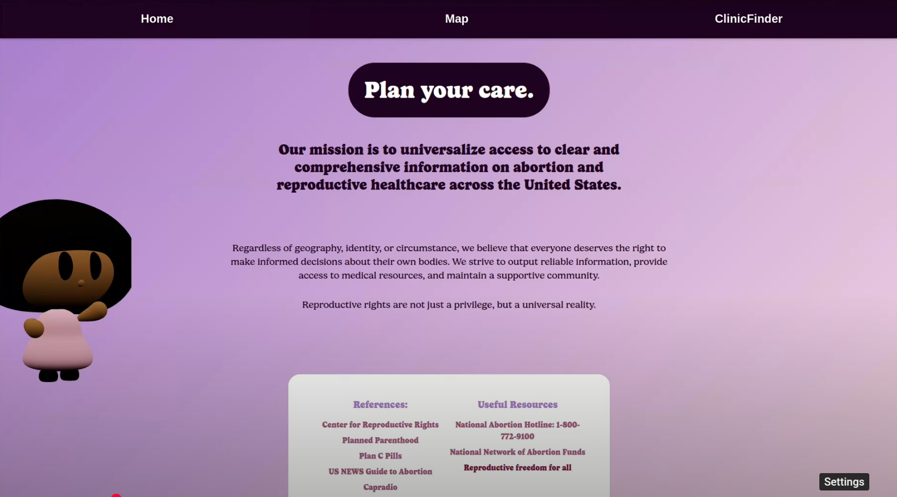

# Plan Your Care

Plan Your Care is a healthcare discovery app for finding reproductive healthcare information, nearby clinics, and state-level resources.

## Live Demo

Devpost: https://devpost.com/software/planurcare

## Screenshots



## Tech Stack

- Frontend: React, Vite, Tailwind CSS
- Backend: Express, Node.js
- Database: MongoDB
- Maps: Google Maps APIs
- Integrations: EmailJS

## Features

- State-level reproductive healthcare information.
- Interactive map UI.
- Local clinic locator.
- Resource pages for care options and policy context.
- Chat-style guidance flow.
- Backend API for application data.

## Recognition

Plan Your Care received Best Overall and Best Use of MongoDB at WingHacks.

## Why I Built This

The project was built during WingHacks to make reproductive healthcare information easier to understand and navigate. The goal was to combine resource discovery, location search, and clear state-level context into one approachable app.

## My Role

I worked across the React frontend, map experience, resource presentation, backend API, and data structure for state and clinic information.

## Architecture

- `frontend` owns the Vite/React app, map interface, resource views, and user-facing flow.
- `backend` owns the Express API and data access.
- `staticDB` contains state and clinic seed data used by the app.

## Hard Parts

- Turning sensitive healthcare information into an interface that felt clear and navigable.
- Combining map search, resource pages, and chat-style guidance without making the app feel fragmented.
- Building a useful product quickly within a hackathon time limit.

## What I Learned

- Public-interest apps need careful wording and simple navigation because users may arrive with urgent questions.
- Hackathon products benefit from a narrow core workflow and a clear product name.
- Keeping seed data structured makes map and resource features easier to iterate on.

## Running Locally

Frontend:

```bash
git clone https://github.com/mattcattb/Winghacks.git
cd Winghacks/frontend
npm install
npm run dev
```

Backend:

```bash
cd ../backend
npm install
npm run dev
```

Create local environment files for API keys, database URLs, and email configuration before running the full app.

## Project Notes

The repository name is still `Winghacks`, but the clearer project name is `Plan Your Care`. The README uses the product name so the repo reads better from GitHub and portfolio links.
